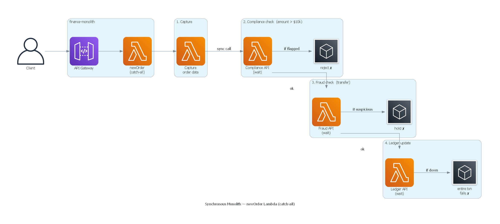
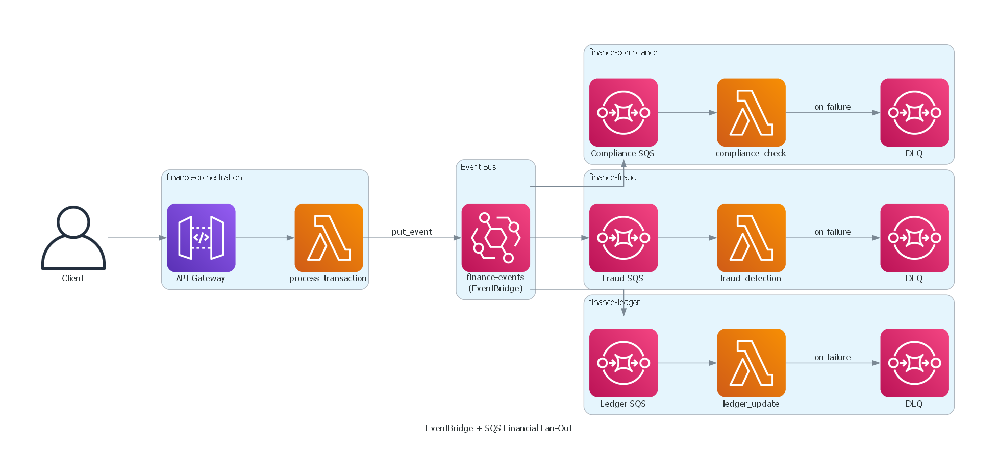

# Fan-Out — Financial EventBridge + SQS Example

## The Problem with Synchronous Order Processing

A financial company processed every transaction through a single monolithic
Lambda triggered by API Gateway:



**What went wrong:**

- **Latency stacked** — the client waited while Compliance called external AML
  databases, Fraud calculated scores, and the ledger committed. A simple deposit
  took seconds because the slowest service dragged the whole chain.
- **Cascade failures** — when the ledger went down during a batch reconciliation,
  every new transaction failed, even deposits that had zero ledger impact.
  Compliance and Fraud checks already passed, but their work was wasted.
- **Bottleneck at scale** — the single `newOrder` Lambda handled ordering,
  compliance, fraud, and ledger logic. The team feared touching it because a
  bug in any branch took down the entire flow.
- **No audit trail** — if a transaction failed midway, there was no record of
  what passed and what didn't. Operations spent hours replaying logs to figure
  out where each transaction stopped.

The company needed a way to decouple these concerns so that each one could
fail, scale, and deploy independently — without the client waiting for all of
them.

## Scope of this Example

This example demonstrates the **basic fan‑out architecture** using Amazon
EventBridge, AWS Lambda, and standard SQS queues with a Dead‑Letter Queue (DLQ).
It focuses on solving the core problems described above—latency stacking,
cascade failures, scaling bottlenecks, and missing audit trails—by
asynchronously distributing transaction events to independent financial domains.

**What this example includes:**
- Event publication from a single entry point (`process_transaction`) to EventBridge.
- EventBridge rules that fan out to three SQS queues (Compliance, Fraud, Ledger).
- Independent Lambda consumers for each queue, with basic error handling.
- A single DLQ for failed messages (dead‑letter queue) to prevent data loss.

**What this example deliberately omits (to be covered in separate examples):**
- Custom retry policies (exponential backoff, redrive strategies).
- FIFO queues (strict message ordering and deduplication).
- Per‑domain DLQs or advanced dead‑letter configurations.
- Idempotency patterns in consumer Lambdas.
- Distributed tracing (AWS X‑Ray) or detailed monitoring dashboards.

## Repository layout

Reusable domain modules live under `domains/`. This example is a thin
composition root under `examples/fanout/` that picks which domains to include
and wires their dependencies:

```
domains/
├── finance_compliance/      # AML screening
├── finance_fraud/           # Fraud scoring
├── finance_ledger/          # Double‑entry bookkeeping
├── finance_orchestration/   # Transaction entry point & EventBridge rules
└── finance_monolith/        # Synchronous comparison (deploy separately)

examples/
└── fanout/
    ├── README.md
    └── infrastructure/
        ├── terraform/       # Composition root — one terraform apply
        └── sam/             # Parent nested-stack template — one sam deploy
```

**Why separate examples?**
Future topics—retry policies, FIFO, idempotency, encryption—will reuse the
same domain modules under `domains/` and declare their own composition root
under `examples/`. That lets you compare implementations without changing the
domain layout. Inclusion is controlled by which `module` / nested-stack
blocks the example root declares (this fan-out root does **not** include the
monolith).

---

## Architecture: EventBridge + SQS Financial Fan‑Out



Every transaction flows through a single entry point
(`process_transaction`), which validates the payload and publishes an event.
EventBridge fans out to three SQS queues, each consumed independently by its
domain's Lambda. Failures land in a Dead‑Letter Queue for later inspection.

---

## Deployment

### Fan‑out (EventBridge + SQS) — one command

The composition root auto-wires queue ARNs from the three consumer domains
into the orchestration domain. No manual two-stage deploy.

#### Terraform

```bash
cd examples/fanout/infrastructure/terraform
terraform init
terraform apply -var="environment=dev"
```

#### SAM

```bash
cd examples/fanout/infrastructure/sam
sam deploy --guided \
  --parameter-overrides Environment=dev
```

### Monolith (comparison) — deploy independently

The monolith is a self‑contained synchronous stack under
`domains/finance_monolith/`. It is **not** part of the fan-out composition
root. Deploy it separately when you want the before/after comparison:

```bash
# Terraform
cd domains/finance_monolith/infrastructure/terraform
terraform init
terraform apply -var="environment=dev"

# SAM
cd domains/finance_monolith/infrastructure/sam
sam deploy --guided
```

---

## Synchronous vs Asynchronous Fan‑Out

### Synchronous (the old way — bad for finance)


**Problems:**
- **Total latency** = sum of all three services. The client waits until every
  downstream system has finished.
- **Cascade failure** – if Ledger is down, the whole transaction fails, even
  though Compliance already passed.
- **Hard to scale** – every consumer must keep up with the same throughput,
  or the slowest one becomes the bottleneck.
- **Tight coupling** – adding a fourth domain (e.g., `finance_reporting`)
  requires changing the orchestrator code.

### Asynchronous fan‑out (EventBridge + SQS)


**Benefits:**
- **Client gets an instant 202** – the transaction is accepted and processed
  in the background.
- **Independent processing** – each consumer runs at its own pace. Fraud can
  be near‑real‑time while Ledger batches for efficiency.
- **Failure isolation** – a Ledger outage doesn't block Compliance or Fraud.
  Failed messages go to a DLQ for replay without data loss.
- **Elastic scaling** – SQS acts as a shock absorber. A traffic spike is
  buffered in the queue and drained at each consumer's pace.
- **Extensible** – adding a new domain is just a new SQS queue + rule in
  EventBridge; no orchestrator changes needed.

### When to use synchronous

- **Read operations** (query a balance, get transaction history).
- **Idempotent writes where latency is critical** (auth tokens, session
  creation).
- **Transactions that must succeed or fail atomically** (rare in distributed
  systems; consider Saga + Step Functions instead).

---

## Local Testing

Each Lambda has a companion `test_lambda.py` that can be run with Python's
built-in `unittest`:

```bash
# From the repository root
python -m pytest domains/finance_orchestration/src/process_transaction/test_lambda.py

python -m pytest domains/finance_compliance/src/compliance_check/test_lambda.py

python -m pytest domains/finance_fraud/src/fraud_detection/test_lambda.py

python -m pytest domains/finance_ledger/src/ledger_update/test_lambda.py

python -m pytest domains/finance_monolith/src/new_order/test_lambda.py
```

For integration testing, use [LocalStack](https://www.localstack.cloud/) or
[sam local invoke](https://docs.aws.amazon.com/serverless-application-model/latest/developerguide/sam-cli-command-reference-sam-local-invoke.html).
